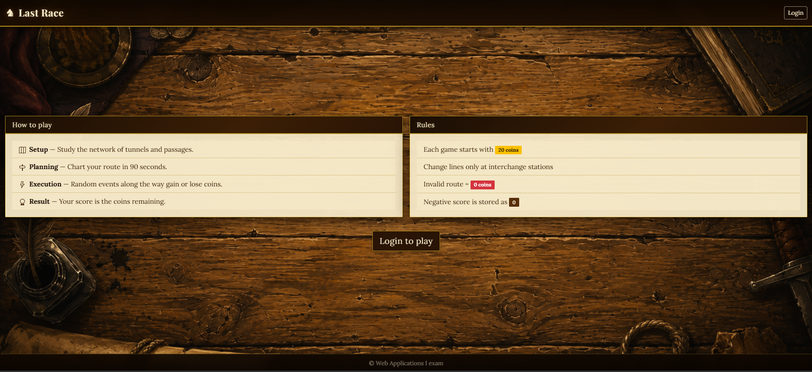
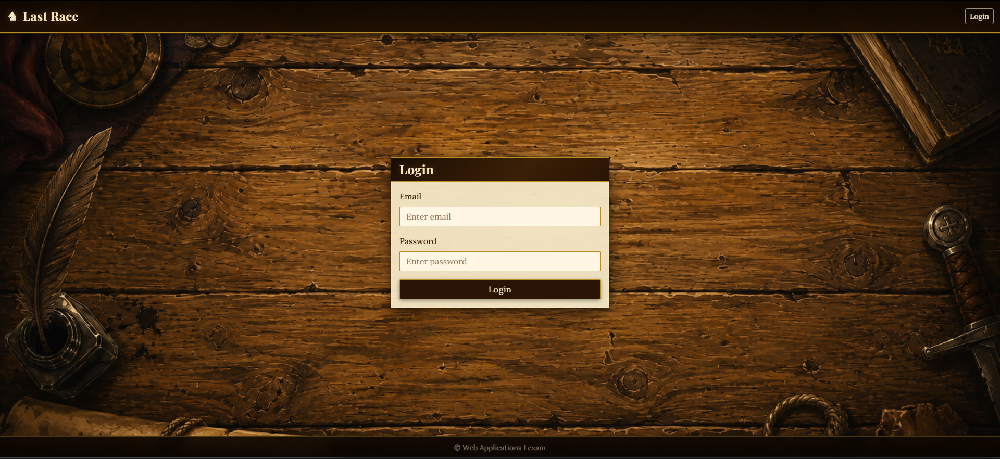
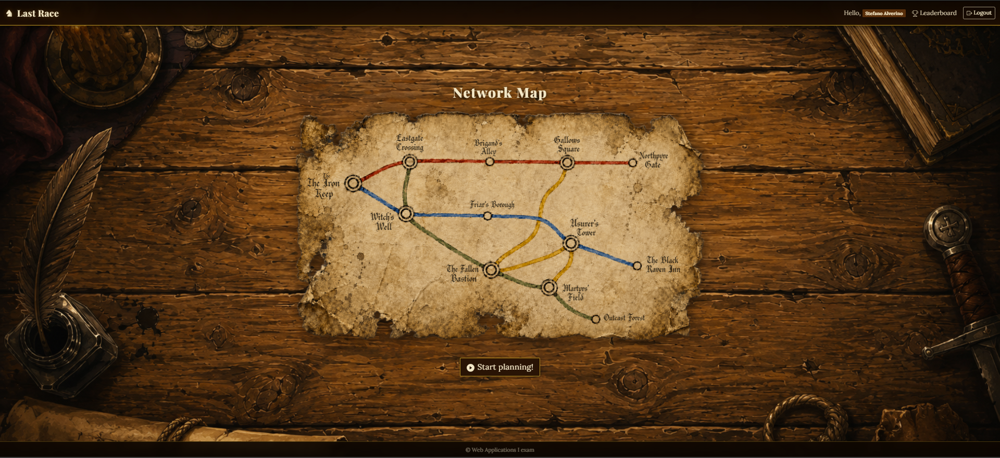
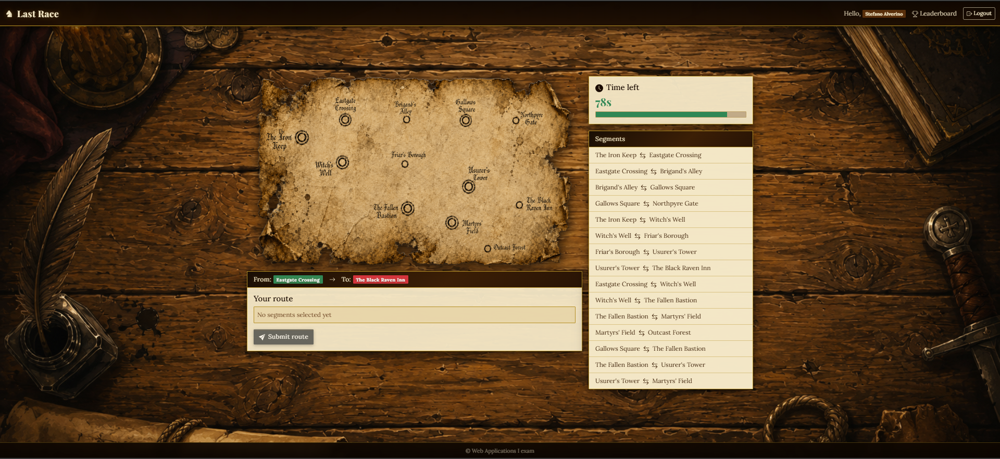
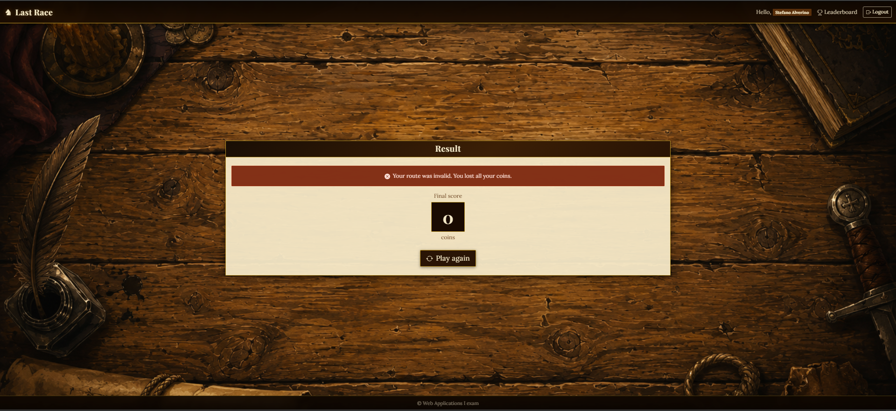
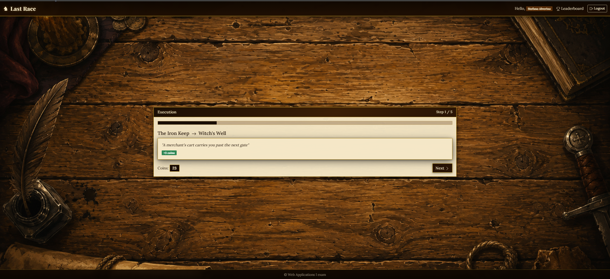
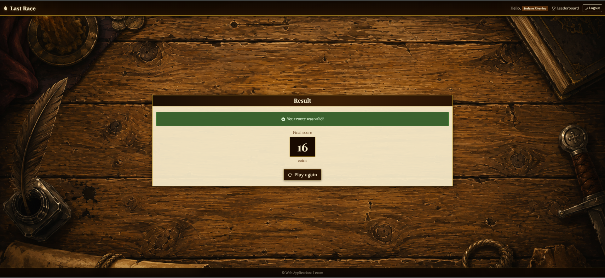
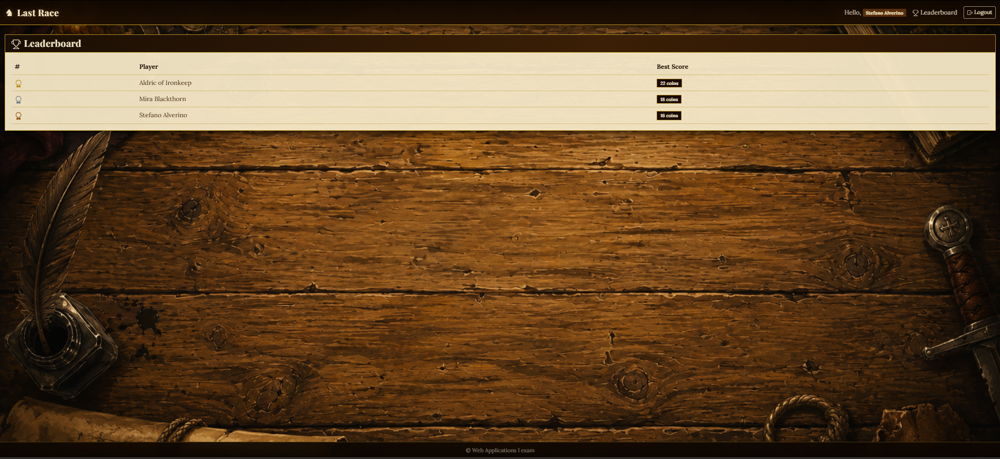

# Exam #1: "Last Race"

## Student: s354116 ALVERINO STEFANO

## React Client Application Routes

- Route `/`: public homepage showing game instructions and login button. Redirects to `/game` if already authenticated.
- Route `/login`: login form with email and password. Redirects to `/game` on success.
- Route `/logout`: triggers server-side session deletion, resets user state and redirects to `/`. Shows a spinner while waiting.
- Route `/game`: main game page (auth required). Manages the four game phases in sequence: setup, planning, execution, result.
- Route `/leaderboard`: global leaderboard showing each user's best score (auth required).

## API Server

- POST `/api/sessions`

  - request body: `{ username: string, password: string }`
  - response: `{ id: number, username: string, name: string }` or 401
- GET `/api/sessions/current`

  - response: `{ id: number, username: string, name: string }` or 401
- DELETE `/api/sessions/current`

  - response: 200
- GET `/api/segments`

  - requires login
  - response: `[{ fromId: number, fromName: string, toId: number, toName: string }]`
- POST `/api/games`

  - requires login
  - response: `{ id: number, startStation: { id: number, name: string }, endStation: { id: number, name: string } }`
- POST `/api/games/:id/route`

  - requires login
  - URL parameter: `id` - game id
  - request body: `{ route: [number] }` - ordered array of station ids
  - response (valid route): `{ valid: true, steps: [{ from: string, to: string, event: string, effect: number, coinsAfter: number }], finalScore: number }`
  - response (invalid route): `{ valid: false, finalScore: 0 }`
- GET `/api/leaderboard`

  - requires login
  - response: `[{ name: string, bestScore: number }]`

## Database Tables

- Table `station` - stores all metro stations (id, name)
- Table `line` - stores all metro lines (id, name)
- Table `line_station` - junction table linking stations to lines with their position order; used to define the network topology and derive all connections
- Table `event` - stores random events that can occur during a segment (id, description, effect from -4 to +4)
- Table `user` - stores registered users with hashed password and salt for authentication (id, email, name, hashed_password, salt)
- Table `game` - stores each game session with assigned start/end stations and final score (NULL while in planning phase) (id, user_id, start_station_id, end_station_id, score)

## Main React Components

- `InstructionsPage` (in `InstructionsPage.jsx`): public landing page with game rules and a login button. Only visible to unauthenticated users.
- `GamePage` (in `GamePage.jsx`): orchestrates the four game phases (setup → planning → execution → result) by managing phase state and invoking the relevant API calls between transitions.
- `SetupPhase` (in `SetupPhase.jsx`): shows the full network map and a start button to begin the planning phase.
- `PlanningPhase` (in `PlanningPhase.jsx`): 90-second timed phase where the player builds a route by selecting segments from a list. Manages the route as an array of `[fromId, toId]` pairs and auto-submits on timeout.
- `ExecutionPhase` (in `ExecutionPhase.jsx`): shows the validated route step by step, displaying the random event and coin balance for each segment. The player advances manually.
- `ResultPhase` (in `ResultPhase.jsx`): displays the final score and a button to start a new game.
- `LeaderboardPage` (in `LeaderboardPage.jsx`): fetches and displays the global ranking with each user's best score.

## Screenshot

## Users Credentials

- aldric@lastrace.it, password1 (two games played)
- mira@lastrace.it, password2 (two games played)
- godfrey@lastrace.it, password3 (no games played)
- stefano@lastrace.it, password4 (no games played)

## Use of AI Tools

I used Claude for CSS and styling, including layout, spacing and visual adjustments such as centering components and card styling. I also used ChatGPT to generate background and map images.

All suggestions were reviewed and manually verified before being integrated. The overall architecture, game logic, and design decisions are my own.
